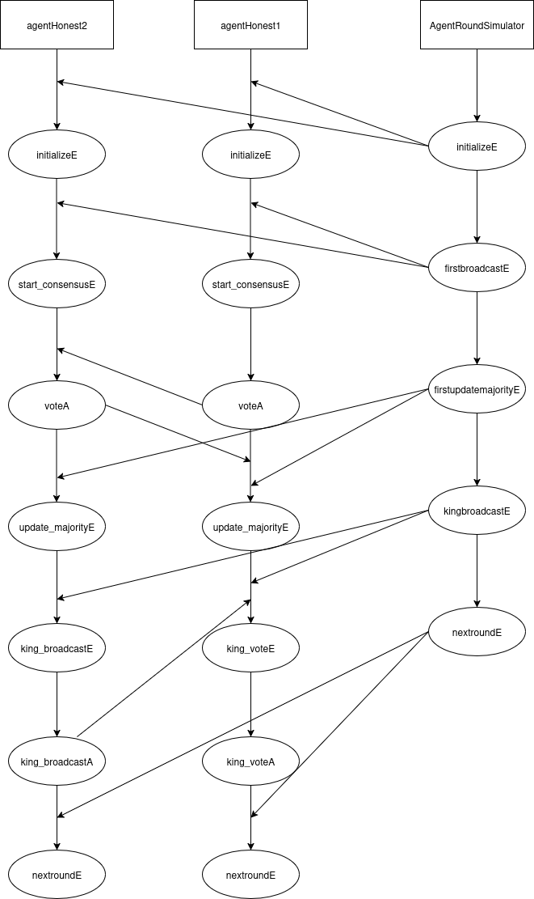

This is an abstraction of the general Sequence Diagram for the algorithm. The behavior depends on the king of the phase and the number of agents:

1. **Initialization:**  
   The `AgentRoundSimulator` triggers an `initialize` event for all agents. Each agent performs its initialization upon receiving this event.

2. **Start Consensus:**  
   The `AgentRoundSimulator` triggers a `start_consensus` event. This event is used to broadcast each agent's preferred value to all other agents. Note that votes can arrive in any order; an agent may receive votes from others before sending its own.

3. **Update Majority:**  
   After consensus starts, the `AgentRoundSimulator` triggers the `update_majority` event. Each agent updates its preferred value based on the received votes.

4. **King Broadcast:**  
   The `AgentRoundSimulator` triggers the `king_broadcast` event for all agents. Only the king of the current phase executes this broadcast, sending its vote to all other agents. The king triggers the `king_vote` event to propagate its vote.

5. **Next Round:**  
   Finally, the `nextround` event is triggered by the `AgentRoundSimulator`, starting the next phase of the algorithm.
